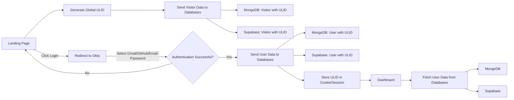

# flowchart

```mermaid
flowchart LR
    A[Landing Page] --> B[Generate Global ULID]
    B --> C[Send Visitor Data to Databases]
    C --> C1[MongoDB: Visitor with ULID]
    C --> C2[Supabase: Visitor with ULID]
    A -->|Click Login| D[Redirect to Okta]
    D -->|Select Gmail/GitHub/Email-Password| E{Authentication Successful?}
    E -->|Yes| F[Send User Data to Databases]
    F --> F1[MongoDB: User with ULID]
    F --> F2[Supabase: User with ULID]
    F --> G[Store ULID in Cookie/Session]
    G --> H[Dashboard]
    H --> I[Fetch User Data from Databases]
    I --> I1[MongoDB]
    I --> I2[Supabase]
    E -->|No| A


```
