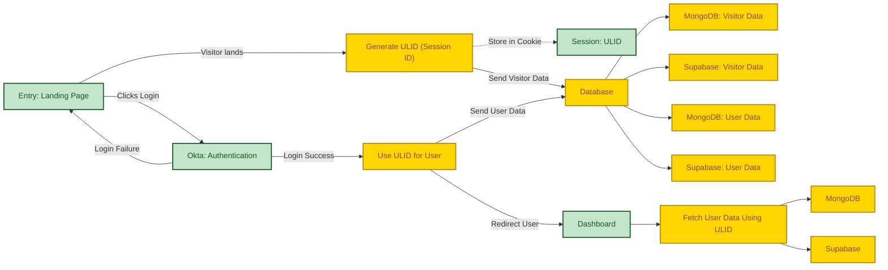

# flowchart

```mermaid
flowchart LR
    %% Class Definitions
    classDef green fill:#c3e6cb,stroke:#155724,stroke-width:2px,color:#155724
    classDef gold fill:#ffd700,stroke:#b8860b,stroke-width:2px,color:#8b4513

    %% Entry Block
    EntryBlock["Entry: Landing Page"]:::green
    GenerateULID["Generate ULID (Session ID)"]:::gold
    ULIDBlock["Session: ULID"]:::green

    EntryBlock -->|"Visitor lands"| GenerateULID
    GenerateULID -.->|"Store in Cookie"| ULIDBlock

    %% Database Block
    DatabaseBlock["Database"]:::gold
    DB1["MongoDB: Visitor Data"]:::gold
    DB2["Supabase: Visitor Data"]:::gold

    GenerateULID -->|"Send Visitor Data"| DatabaseBlock
    DatabaseBlock --> DB1
    DatabaseBlock --> DB2

    %% Okta Block
    OktaBlock["Okta: Authentication"]:::green
    UpdateULID["Use ULID for User"]:::gold

    EntryBlock -->|"Clicks Login"| OktaBlock
    OktaBlock -->|"Login Success"| UpdateULID
    UpdateULID -->|"Send User Data"| DatabaseBlock
    DB3["MongoDB: User Data"]:::gold
    DB4["Supabase: User Data"]:::gold
    DatabaseBlock --> DB3
    DatabaseBlock --> DB4
    OktaBlock -->|"Login Failure"| EntryBlock

    %% Dashboard Block
    DashboardBlock["Dashboard"]:::green
    FetchData["Fetch User Data Using ULID"]:::gold

    UpdateULID -->|"Redirect User"| DashboardBlock
    DashboardBlock --> FetchData
    FetchData --> DB5["MongoDB"]:::gold
    FetchData --> DB6["Supabase"]:::gold


```
